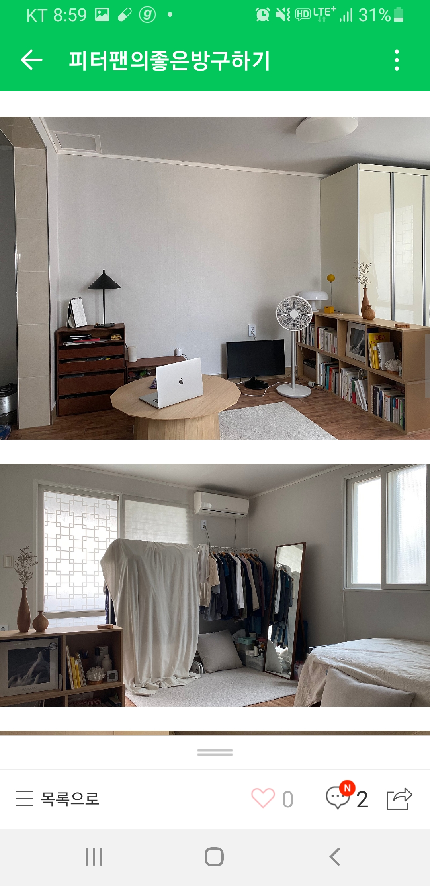
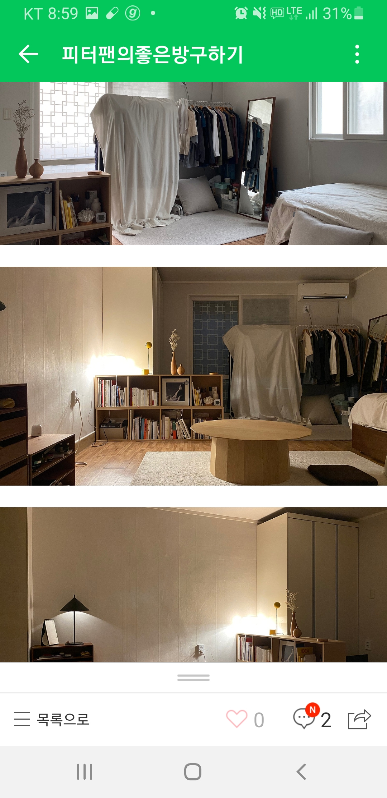
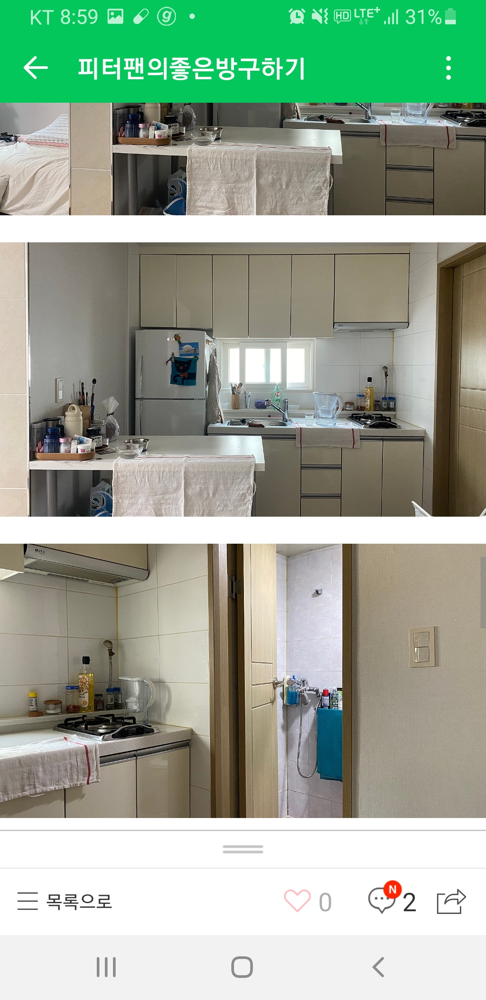

|집위치(역)|집사진|가격(관리비+중기청이자)|역과의거리(도보)|직장까지의 거리(대중교통)|거리(자전거)|평수|방개수|층수|화장실컨디션|채광|옵션|대출가능여부|기타사항|
|---|------|---|---|---|---|---|---|---|---|---|---|---|---|
|합정|테스트1|2000/60|4분|29분|25분|8평|1.5룸(+배란다)|3층(엘베x)|Normal|O|O|X|야외 테라스(?)같은 공간 있지만 실효성은 X|

