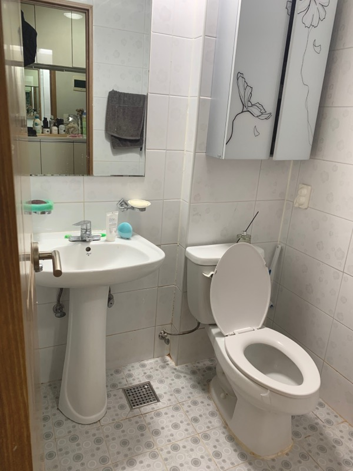
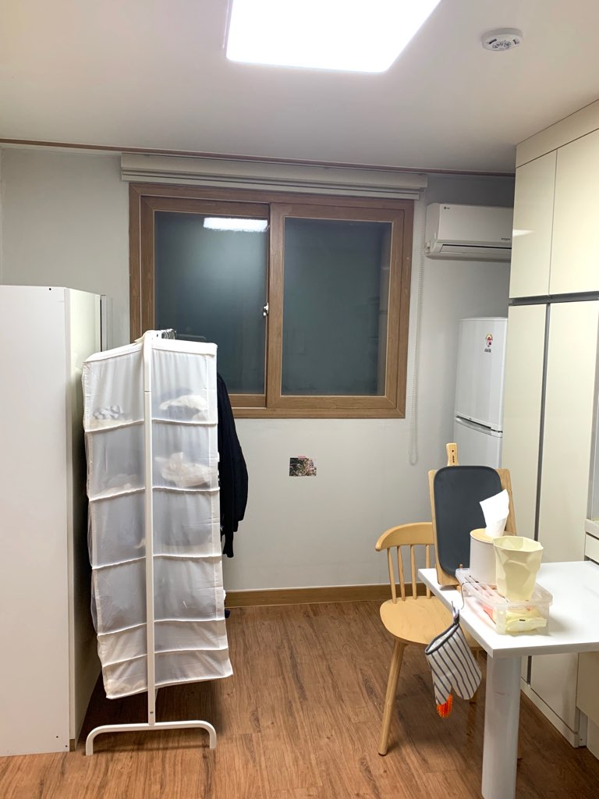
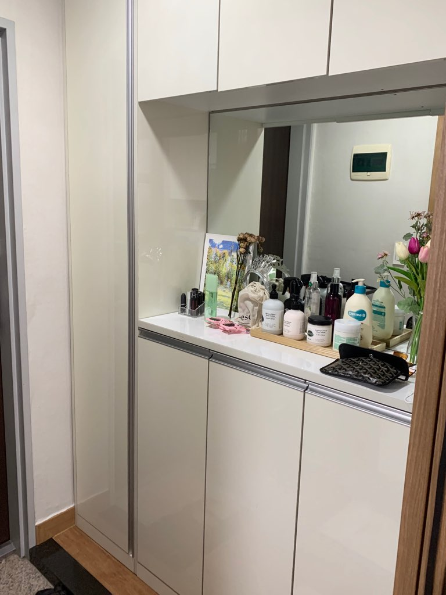
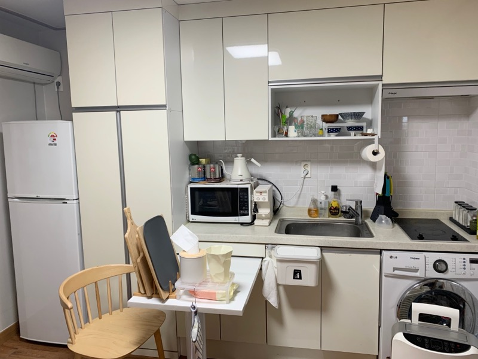
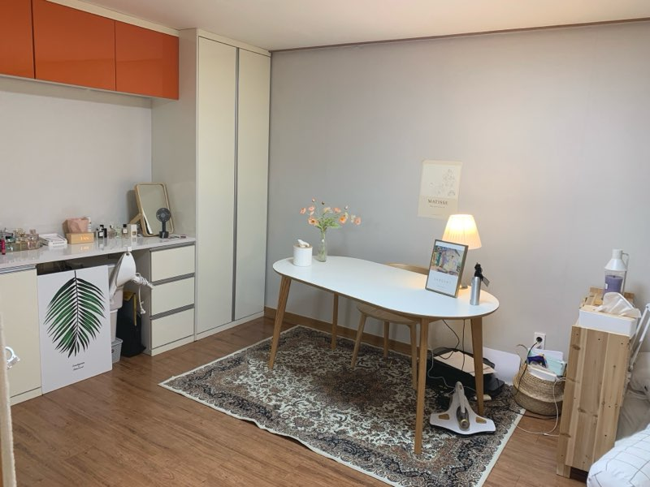
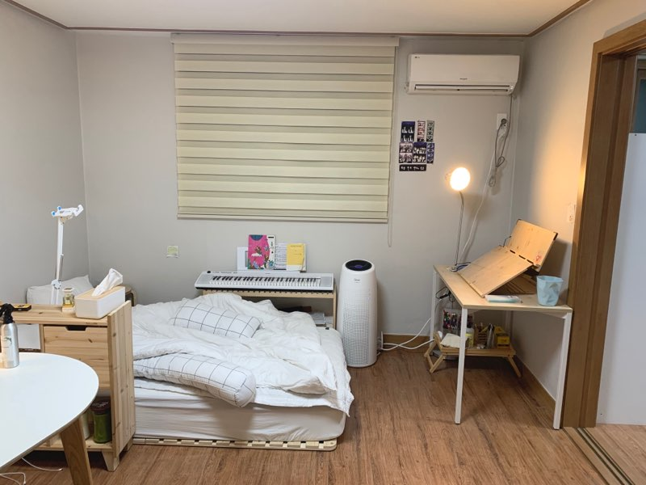

|집위치(역)|집사진|가격(관리비+중기청이자)|역과의거리(도보)|직장까지의 거리(대중교통)|거리(자전거)|평수|방개수|층수|화장실컨디션|채광|옵션|대출가능여부|기타사항|
|---|------|---|---|---|---|---|---|---|---|---|---|---|---|
|당산|테스트1|1.2억/45|13분|35분|38분|8평|1.5룸|3층|작음|X|O|O|역이랑 도보로 좀 멈, 조용, 거의신축, 구조 괜찮, 주차시설 좋음, 화장실 작은게 좀 흠|

</img>
</img>
</img>
</img>
</img>
</img>
</img>
</img>
